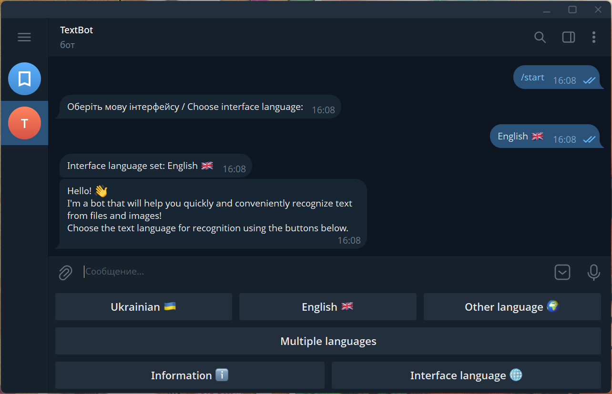
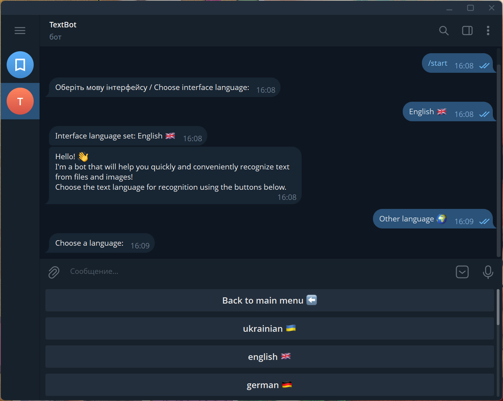
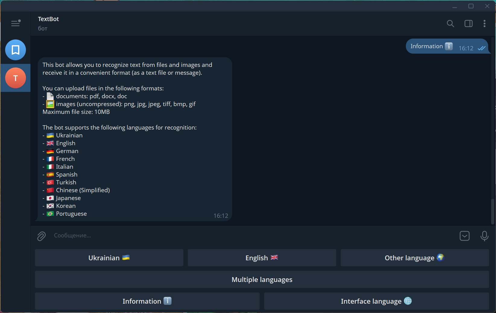
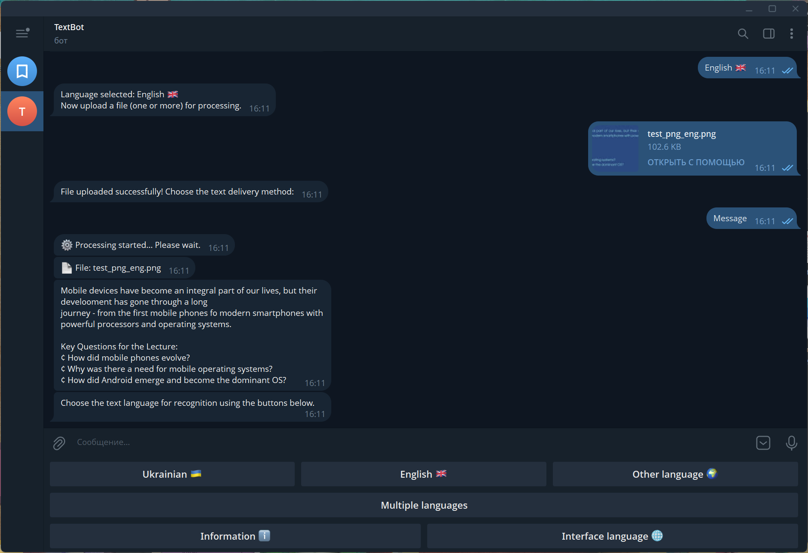
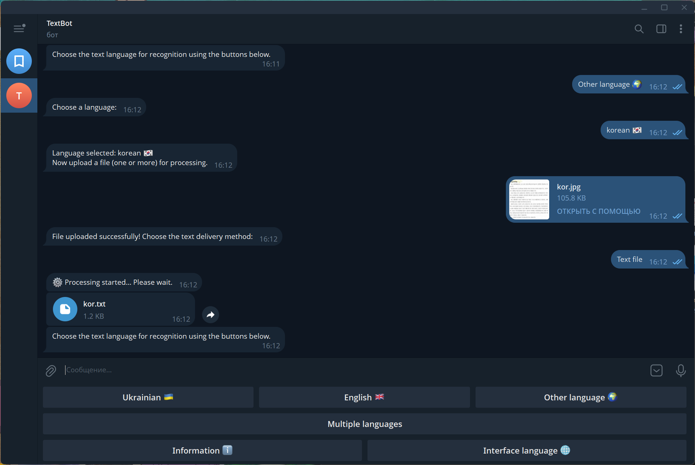

# 🔍 OCR Telegram Bot

A Telegram bot that extracts text from images and documents using Tesseract OCR. Supports multiple languages and
delivers results as messages or text files.


## ✨ Features

- **Multi-format support**: PDF, DOCX, DOC, PNG, JPG, JPEG, TIFF, BMP, GIF
- **11 OCR languages**: Ukrainian, English, German, French, Italian, Spanish, Turkish, Chinese (Simplified), Japanese,
  Korean, Portuguese
- **Multi-language OCR**: Recognize text in multiple languages simultaneously
- **Flexible delivery**: Receive results as Telegram messages or downloadable text files
- **Bilingual interface**: Ukrainian and English UI
- **Concurrent processing**: Handle multiple users simultaneously
- **File size limit**: Up to 10MB per file

## 📸 Screenshots

|                                |                                                  |
|--------------------------------|--------------------------------------------------|
| Start                          |                   |
| Language Selection             |           |
| Bot Info                       |                 |
| Recognition result (message)   |  |
| Recognition result (.txt file) |          |

## 🚀 Getting Started

### Prerequisites

- Python 3.9+
- Tesseract OCR installed on your system
- Telegram Bot Token (get from [@BotFather](https://t.me/BotFather))

### Local Installation

1. **Clone the repository**
   ```bash
   git clone https://github.com/yourusername/OCR_Telegram_Bot.git
   cd OCR_Telegram_Bot
   ```

2. **Install Tesseract OCR**

   **Windows:**
    - Download installer from [UB-Mannheim/tesseract](https://github.com/UB-Mannheim/tesseract/wiki)
    - Install with additional language packs (Ukrainian, German, etc.)
    - Default path: `C:\Program Files\Tesseract-OCR\tesseract.exe`

   **Ubuntu/Debian:**
   ```bash
   sudo apt-get update
   sudo apt-get install tesseract-ocr tesseract-ocr-eng tesseract-ocr-ukr tesseract-ocr-deu tesseract-ocr-fra tesseract-ocr-ita tesseract-ocr-spa tesseract-ocr-tur tesseract-ocr-chi-sim tesseract-ocr-jpn tesseract-ocr-kor tesseract-ocr-por
   ```

   **macOS:**
   ```bash
   brew install tesseract tesseract-lang
   ```

3. **Create virtual environment**
   ```bash
   python -m venv .venv
   
   # Windows
   .venv\Scripts\activate
   
   # Linux/macOS
   source .venv/bin/activate
   ```

4. **Install dependencies**
   ```bash
   pip install -r requirements.txt
   ```

5. **Configure environment**
   ```bash
   cp .env.example .env
   ```
   Edit `.env` and add your Telegram bot token:
   ```
   TOKEN=your_bot_token_here
   ```

6. **Run the bot**
   ```bash
   python bot.py
   ```

### 🐳 Docker Installation

1. **Clone the repository**
   ```bash
   git clone https://github.com/yourusername/OCR_Telegram_Bot.git
   cd OCR_Telegram_Bot
   ```

2. **Configure environment**
   ```bash
   cp .env.example .env
   ```
   Edit `.env` and add your Telegram bot token.

3. **Build and run with Docker Compose**
   ```bash
   docker-compose up -d --build
   ```

4. **View logs**
   ```bash
   docker-compose logs -f
   ```

5. **Stop the bot**
   ```bash
   docker-compose down
   ```

## 📁 Project Structure

```
OCR_Telegram_Bot/
├── bot.py                 # Main entry point
├── consts.py              # Configuration constants
├── localization.py        # Translation management
├── reader.py              # OCR processing logic
├── translations.json      # UI translations (UK/EN)
├── requirements.txt       # Python dependencies
├── Dockerfile             # Docker image configuration
├── docker-compose.yml     # Docker Compose configuration
├── handlers/              # Telegram bot handlers
│   ├── __init__.py
│   ├── start.py           # /start command handler
│   ├── menu.py            # Menu navigation
│   ├── files.py           # File upload handler
│   └── delivery.py        # OCR processing & delivery
├── utils/                 # Utility modules
│   ├── __init__.py
│   ├── logger.py          # Logging configuration
│   ├── keyboards.py       # Telegram keyboards
│   ├── filters.py         # Message filters
│   └── helpers.py         # Helper functions
├── logs/                  # Log files (auto-created)
└── static/                # Temporary files (auto-created)
```

## 🔧 Configuration

Edit `consts.py` to customize:

| Setting                  | Default                                        | Description            |
|--------------------------|------------------------------------------------|------------------------|
| `MAX_SIZE`               | 10 MB                                          | Maximum file size      |
| `ALLOWED_FORMATS`        | pdf, docx, doc, png, jpg, jpeg, tiff, bmp, gif | Supported file formats |
| `DEFAULT_INTERFACE_LANG` | uk                                             | Default UI language    |
| `LOG_LEVEL`              | INFO                                           | Logging verbosity      |

## 📝 Usage

1. Start the bot with `/start`
2. Select interface language (Ukrainian or English)
3. Choose OCR language(s) for text recognition
4. Upload your document or image
5. Select delivery method (message or text file)
6. Receive extracted text!

## 📄 License

This project is licensed under the MIT License - see the [LICENSE](LICENSE) file for details.

## 🙏 Acknowledgments

- [Tesseract OCR](https://github.com/tesseract-ocr/tesseract) - OCR engine
- [python-telegram-bot](https://github.com/python-telegram-bot/python-telegram-bot) - Telegram Bot API wrapper
- [PyMuPDF](https://github.com/pymupdf/PyMuPDF) - PDF processing
- [python-docx](https://github.com/python-openxml/python-docx) - DOCX processing